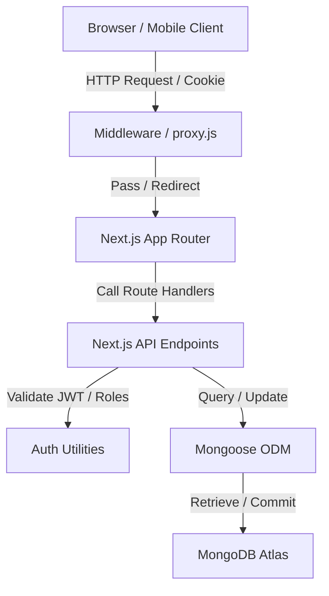
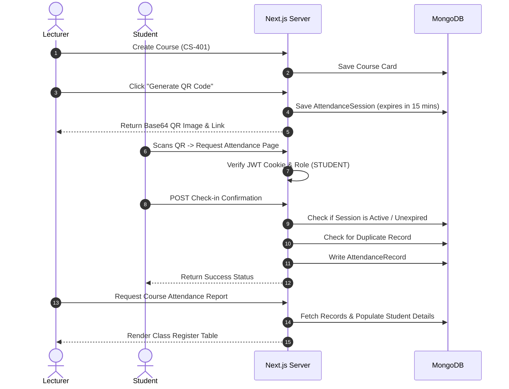

# Smart QR Attendance Management System

A modern, secure, and automated attendance management system built using **Next.js 15**, **MongoDB**, and **Tailwind CSS**. This system replaces slow, unreliable, and manual paper-based attendance sheets with dynamically generated secure QR codes, enabling instant attendance validation and real-time reporting.

---

## 1. Overview

Traditional classroom attendance tracking suffers from several distinct bottlenecks:
- **Circulation Delay**: Passing around a sign-in sheet wastes valuable lecture time.
- **Proxy Attendance**: Students easily sign in for absent classmates.
- **Data Entry Bottlenecks**: Manually transferring written logs into digital spreadsheets is tedious and error-prone.

The **Smart QR Attendance Management System** solves these issues. Lecturers generate dynamic QR codes valid only for the active lecture duration (15 minutes). Students authenticate and scan the code using their mobile device camera. The system instantly verifies authorization, ensures the student is physically present/on-site, checks for duplicates, timestamps the database, and feeds real-time attendance statistics into the lecturer's reporting panel.

---

## 2. Features

- **Double-Agent Authentication**: Support for two distinct roles: `LECTURER` and `STUDENT`.
- **JWT Session Protection**: Authentication session states managed securely via encrypted JWT tokens in HTTP-only cookies.
- **Role-Based Access Control (RBAC)**: Secure route protection at both API endpoints and rendering pages via middleware.
- **Course Administration**: Lecturers can register new courses with unique codes.
- **Dynamic QR Generator**: Generates base64 QR codes containing unique cryptographic session tags that expire in 15 minutes.
- **Instant Attendance Scan**: Student interface reads codes, validates parameters, and logs check-ins.
- **Duplicate Prevention**: Database indexes prevent multiple check-ins by the same student in a single session.
- **Comprehensive Reports**: Detailed dashboards showing aggregate student register tables, check-in timestamps, and overall performance.
- **Modern SaaS Dark UI**: A responsive, clean dark theme styled with Tailwind CSS, custom transitions, and interactive components.

---

## 3. System Architecture



### Frontend
Built with **Next.js App Router** (React Server & Client Components) styled using **Tailwind CSS**. Designed mobile-first for student scans.

### Backend
Implemented with **Next.js Route Handlers** (API Endpoints). Uses Mongoose database wrappers, handles JWT session validations, and coordinates request payloads.

### Database
A **MongoDB Atlas** database instances mapping collections via Mongoose. Schema indexes guarantee structural integrity (e.g., student-session uniqueness).

### Authentication
JWT tokens containing profile payloads (`id`, `name`, `email`, `role`) signed on the server and returned as HTTP-only cookies. Verified via middleware for client routes.

### Attendance Flow
Lecturer generates session -> DB stores code/expiration -> Client scans URL -> Server validates constraints -> DB commits check-in log.

---

## 4. Database Models

The schema models are implemented in `src/models/` and utilize standard Mongoose formatting:

### User
Stores account profiles and login credentials:
- `name` (String, required)
- `email` (String, unique, required)
- `password` (String, hashed, required)
- `role` (String, enum: `LECTURER` or `STUDENT`, required)

### Course
Represents academic courses managed by lecturers:
- `title` (String, required)
- `code` (String, unique, uppercase, required)
- `lecturerId` (ObjectId, ref: `User`, required)

### AttendanceSession
Tracks temporary QR scan sessions:
- `courseId` (ObjectId, ref: `Course`, required)
- `code` (String, unique, required)
- `expiresAt` (Date, required)
- `active` (Boolean, default: true)

### AttendanceRecord
Logs completed check-ins:
- `studentId` (ObjectId, ref: `User`, required)
- `courseId` (ObjectId, ref: `Course`, required)
- `sessionId` (ObjectId, ref: `AttendanceSession`, required)
- `markedAt` (Date, default: Date.now)
*Unique index constraint: `{ studentId: 1, sessionId: 1 }` prevents duplicates.*

---

## 5. Attendance Workflow



---

## 6. Project Structure

```text
smart-attendance/
├── public/                 # Static assets (images, SVGs)
├── src/
│   ├── app/
│   │   ├── api/            # Next.js Serverless Route Handlers
│   │   │   ├── attendance/
│   │   │   │   ├── generate/route.js    # QR & session generator
│   │   │   │   ├── mark/route.js        # Mark student check-in
│   │   │   │   ├── my-records/route.js  # Student history retrieval
│   │   │   │   └── reports/[courseId]/route.js # Lecturer report query
│   │   │   ├── auth/
│   │   │   │   ├── login/route.js       # JWT creation & cookie set
│   │   │   │   ├── logout/route.js      # Cookie removal
│   │   │   │   ├── me/route.js          # Current user validation
│   │   │   │   └── register/route.js    # Account registration
│   │   │   └── courses/
│   │   │       └── route.js             # Course fetch & creation
│   │   ├── attendance/
│   │   │   └── mark/
│   │   │       └── page.jsx             # Interactive check-in view
│   │   ├── dashboard/
│   │   │   ├── lecturer/
│   │   │   │   ├── reports/[courseId]/  
│   │   │   │   │   └── page.js          # Dynamic report register UI
│   │   │   │   ├── components.js        # Lecturer navbar & forms
│   │   │   │   └── page.js              # Lecturer dashboard page
│   │   │   └── student/
│   │   │       ├── components.js        # Student navbar & dialogs
│   │   │       └── page.js              # Student logs page
│   │   ├── login/
│   │   │   └── page.js                  # Login screen with eye toggle
│   │   ├── register/
│   │   │   └── page.js                  # Sign-up screen with eye toggle
│   │   ├── globals.css                  # Tailwind CSS variables
│   │   ├── layout.js                    # Global layout configuration
│   │   └── page.jsx                     # Modern SaaS Landing page
│   ├── lib/
│   │   ├── auth.js                      # Server-side JWT validators
│   │   └── mongodb.js                   # Mongoose database client cached hook
│   ├── models/                          # Database models schemas
│   │   ├── AttendanceRecord.js
│   │   ├── AttendanceSession.js
│   │   ├── Course.js
│   │   └── User.js
│   └── proxy.js                         # Next.js Route Protection proxy
├── .env.example                         # Environment template
├── jsconfig.json                        # Path alias configuration
├── next.config.mjs                      # Next.js compiler settings
├── package.json                         # Project dependencies
└── README.md                            # Documentation
```

---

## 7. Installation

Follow these steps to set up the project locally:

1. **Clone the Repository**:
   ```bash
   git clone https://github.com/o1-spec/smart-attendance-.git
   cd smart-attendance-
   ```

2. **Install Dependencies**:
   ```bash
   npm install
   ```

3. **Set Up Environment Variables**:
   Create a `.env` file in the root directory (see [Environment Variables](#8-environment-variables)).

4. **Run the Development Server**:
   ```bash
   npm run dev
   ```
   Open [http://localhost:3000](http://localhost:3000) to view the landing page.

---

## 8. Environment Variables

Create a `.env` file in the root folder and configure the following parameters:

```env
# MongoDB Atlas Database URI Connection String
MONGODB_URI=mongodb+srv://<username>:<password>@cluster.mongodb.net/smart-attendance

# Cryptographic token signing secret key
JWT_SECRET=your_jwt_signing_secret_key_here

# Public base url for QR generation routing
NEXT_PUBLIC_APP_URL=http://localhost:3000
```

---

## 9. API Endpoints

### Authentication
- `POST /api/auth/register` : Creates an account (`LECTURER` or `STUDENT`) and automatically logs the user in.
- `POST /api/auth/login` : Validates credentials, creates a JWT token, and returns it as an HTTP-only cookie.
- `POST /api/auth/logout` : Deletes the JWT session token cookie.
- `GET /api/auth/me` : Checks active JWT session and returns user metadata.

### Course Management
- `GET /api/courses` : Fetches courses created by the logged-in lecturer.
- `POST /api/courses` : Creates a new course. *(Lecturer role required)*.

### Attendance
- `POST /api/attendance/generate` : Generates a unique `AttendanceSession` code and returns a Base64 QR Image containing the check-in URL. *(Lecturer role required)*.
- `POST /api/attendance/mark` : Registers student presence for an active session. *(Student role required)*.
- `GET /api/attendance/my-records` : Fetches history of attendance logs for the logged-in student.
- `GET /api/attendance/reports/[courseId]` : Retrieves the complete register list of check-ins for a specific course. *(Owner lecturer role required)*.

---

## 10. Security Features

- **Password Hashing**: Uses `bcryptjs` with a cost factor of 10 to hash passwords securely.
- **JWT in HTTP-only Cookies**: Protects against Cross-Site Scripting (XSS) attacks by preventing client-side scripts from reading the token.
- **Route Guard Middleware**: Restricts routes `/dashboard/lecturer/*` to lecturers, and `/dashboard/student/*` or `/attendance/mark/*` to students. Unauthenticated users are redirected to login.
- **Dynamic Check-in Expiration**: QR code URLs contain codes mapped to an expiration window. Expired requests (past 15 minutes) are blocked by the API.
- **Duplicate Prevention Rules**: The database enforces a compound index of `{ studentId: 1, sessionId: 1 }` with a unique constraint, preventing double check-ins.

---

## 11. Screenshots Section (Placeholders)

*Screenshots for presentation templates and documentation panels:*

- **Landing Page**: SaaS design style with glowing background shapes and an interactive mock dashboard.
- **Login Screen**: Interactive clean card interface with password visibility toggle.
- **Lecturer Dashboard**: Shows card metrics (Total Courses, Active QR, Records count) and Course Generator.
- **Student Dashboard**: Shows Personal Profile context, count of check-ins, and sorted history logs.
- **QR Generation Dialog**: Displays course info, QR image block, countdown timer, and shareable link.
- **Attendance Reports Page**: Dynamic register display containing complete lists of present student details.

---

## 12. Future Improvements

To scale the system for enterprise-grade educational institutions, the following improvements can be added:
- **GPS Validation**: Cross-reference the student's current geolocation with the lecture hall coordinates during scanning to prevent remote check-ins.
- **Facial Recognition**: Require a quick face match check during the scan process using the device camera.
- **Export to Excel/PDF**: Add button handlers to instantly download register sheets for archiving.
- **Email Notifications**: Automatic alerts to students showing their current course attendance rates.
- **Native Mobile Apps**: Custom iOS and Android apps with integrated QR scanner controls.

---

## 13. Author

**Oluwafemi Onadokun**
- *Role*: Final Year Computer Science Student
- *Specialization*: Fullstack Software Development

---

## 14. License

This project is licensed under the MIT License. See [LICENSE](LICENSE) for details.
